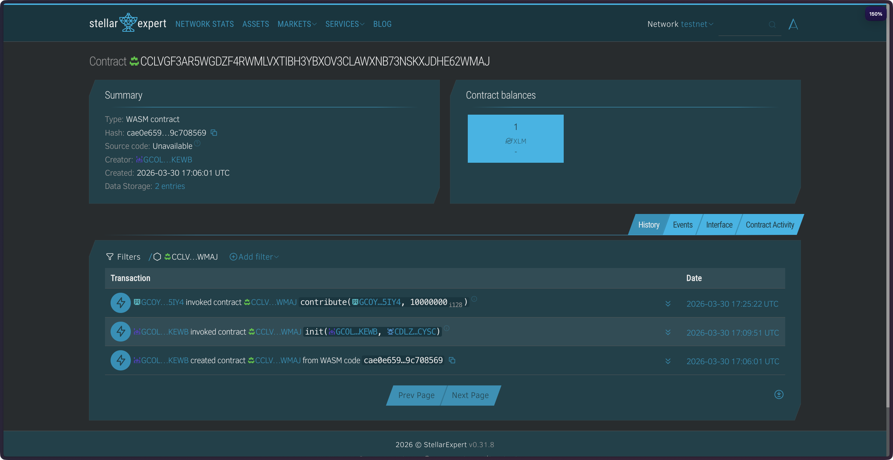

# PasadaFund: Stellar Route Resilience Protocol


PasadaFund is a Soroban-based protocol designed to support route continuity for Jeepney and Tricycle transport groups through transparent, auditable, and community-governed reserve management on Stellar.

It combines a real on-chain XLM reserve pool with proposal-based governance and a production-ready React dashboard.

Live site: https://stellar-pasada-fund.vercel.app/

## Vision

Build a trustworthy public-good reserve protocol where support decisions are transparent, auditable, and governed directly by contributors and members on Stellar.

## Repository Scope

This repository contains the complete full-stack implementation:

- `contracts/pasadafund`: Soroban smart contract (Rust)
- `frontend`: React + Vite web dashboard with Freighter + Stellar SDK integration

## Core Features

- Real reserve pool transfers using `soroban_sdk::token::Client` against the native XLM SAC
- Contributor-to-member governance model
- Route support proposal creation and on-chain voting
- Approval threshold of 2 votes
- On-chain proposal execution that transfers reserve pool funds to recipient wallets
- Frontend stroop-safe arithmetic using `BigInt` with 7-decimal precision
- Static simulation account for stable `simulateTransaction` behavior
- Dual RPC fallback for improved reliability
- Dashboard UX with glassmorphism, transaction history, and success-state confetti
- Unified activity feed combining on-chain events and local transaction logs

## Deployed Contract Details (Testnet)



- Contract ID: `CCLVGF3AR5WGDZF4RWMLVXTIBH3YBXOV3CLAWXNB73NSKXJDHE62WMAJ`
- Admin Address: `GCOLFCAVXCQ6PEVYVFI64WKVDBELGPDROK76L5QQCA3AWHTNPRDSKEWB`
- Native XLM SAC (testnet): `CDLZFC3SYJYDZT7K67VZ75HPJVIEUVNIXF47ZG2FB2RMQQVU2HHGCYSC`
- Explorer: https://stellar.expert/explorer/testnet/contract/CCLVGF3AR5WGDZF4RWMLVXTIBH3YBXOV3CLAWXNB73NSKXJDHE62WMAJ
- Stellar Lab: https://lab.stellar.org/r/testnet/contract/CCLVGF3AR5WGDZF4RWMLVXTIBH3YBXOV3CLAWXNB73NSKXJDHE62WMAJ

## Transaction Proofs

- Upload WASM transaction: https://stellar.expert/explorer/testnet/tx/8fbe62156798d88d13854f1f57ed5e70a7a53cc6ce3658a2e7c907d8a24c07a0
- Contract deployment transaction: https://stellar.expert/explorer/testnet/tx/968f1e158eb81166ceef51091f44badf60c2998dcec306e9bbfbf570ed7c44dd
- Contract initialization transaction: https://stellar.expert/explorer/testnet/tx/71461bfdbd6d8bda5fb7b6c2b8aaef8951869253b0f037aff98a4f379c5fcd91

## Local Development

### 1. Smart Contract

```bash
cd contracts/pasadafund
cargo check
cargo test
stellar contract build
```

### 2. Frontend

```bash
cd frontend
cp .env.example .env
npm install
npm run dev
```

## Frontend Environment Variables

Configure the following values in `frontend/.env`:

- `VITE_PASADAFUND_CONTRACT_ID`
- `VITE_NATIVE_XLM_CONTRACT_ID`
- `VITE_STELLAR_NETWORK_PASSPHRASE`
- `VITE_STELLAR_RPC_PRIMARY`
- `VITE_STELLAR_RPC_SECONDARY`

## Vercel Deployment

This repository is configured for root-level Vercel deployment through `vercel.json`:

- Install command: `npm --prefix frontend install`
- Build command: `npm --prefix frontend run build`
- Output directory: `frontend/dist`

Set the same environment variables listed above in your Vercel project settings.

## Build Validation

```bash
cd contracts/pasadafund && cargo test
cd ../../frontend && npm run build
```

## Maintainer

<table align="center" border="0" cellpadding="0" cellspacing="0" width="100%">
  <tr>
    <td align="center" width="50%" style="padding-top: 20px;">
      <br>
      <strong>Adriel Magalona</strong><br>
      <a href="https://www.linkedin.com/in/adr1el/">
        
      </a>
    </td>
  </tr>
</table>

